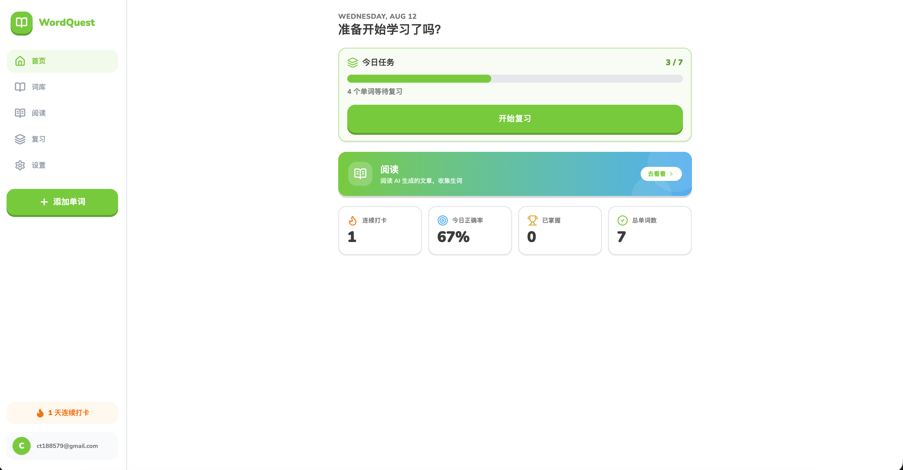
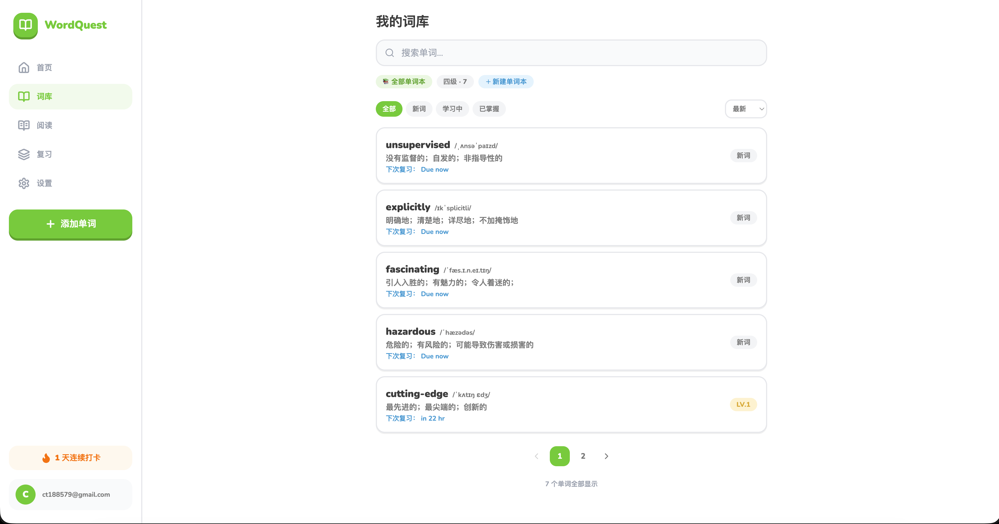
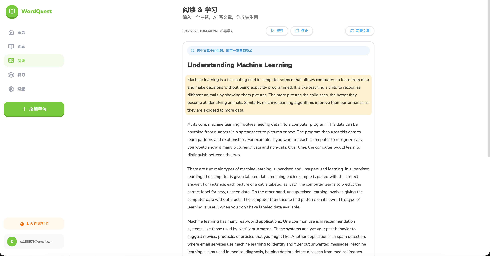
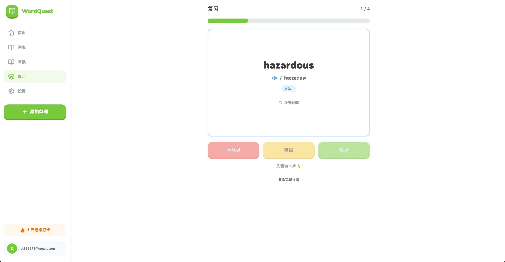
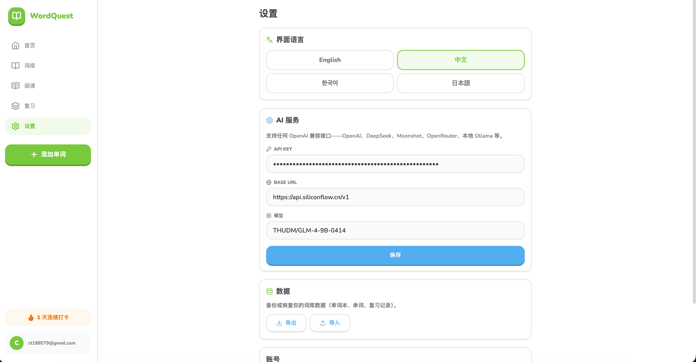
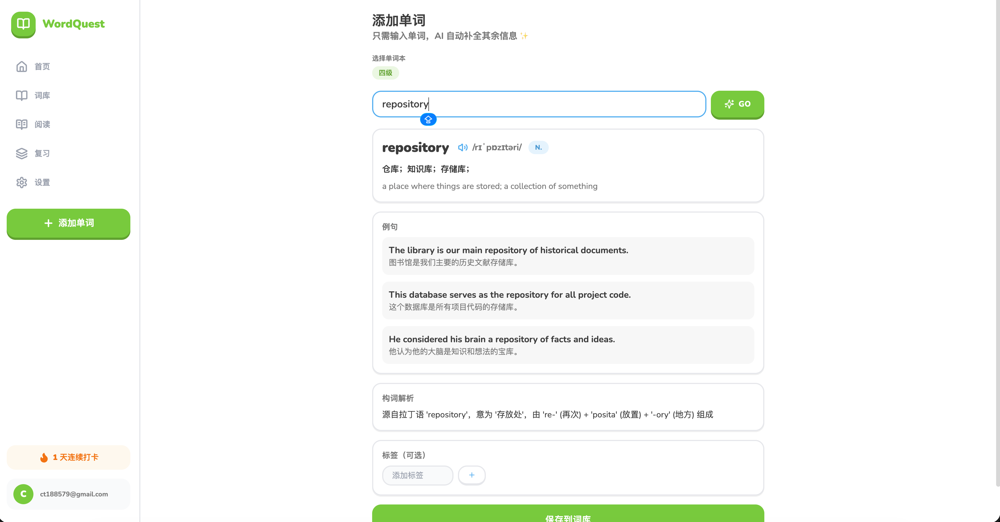

<div align="center">

# 🦉 WordQuest

**个人英语单词学习网站 · Duolingo 风格 · AI 驱动**

输入一个单词，AI 自动补全音标、释义、例句、词根词缀；基于艾宾浩斯遗忘曲线的科学复习；还能让 AI 按主题写文章，选中生词一键收入词库。

</div>
🌐 官方网站：https://word-quest-website.ctstudio.cloud

---

## ✨ 功能特性

| 模块 | 说明 |
| --- | --- |
| 📝 **极简添加单词** | 只需输入单词，AI 自动补全：音标、中文/英文释义、词性、2-3 个例句、词根词缀解释；任何字段都支持手动编辑 |
| 🧠 **艾宾浩斯复习** | 8 级间隔阶梯（10 分钟 → 1 天 → 2 天 → 4 天 → 7 天 → 15 天 → 30 天 → 60 天），Anki 简化版调度；认识/模糊/不认识三档反馈动态调整间隔 |
| 📚 **多语言单词本** | 可创建英语、中文、韩语、日语等任意语言的单词本，单词分本管理，AI 按目标语言生成内容，喇叭按对应语言发音 |
| 📖 **阅读模式** | 输入主题（AI / 金融…），AI 生成一篇短文；选中文中生词弹出查询窗，一键跳转添加页自动填充；支持整篇朗读 + 段落高亮 + 播放/暂停/停止 |
| ⭐ **收藏本** | 短语 / 句子分类收藏，随时保存阅读中遇到的表达；单词详情页例句可一键收藏，支持翻译与备注 |
| ⚡ **AI 增强** | 更多例句 / 词根词缀拆解 / 易混词对比 / 用学过的词生成短文，一键保存到笔记 |
| 💾 **数据备份** | 全量 JSON 导出 / 导入（单词本、单词、复习历史），导入自动去重并保留复习进度 |
| 🌍 **国际化** | 界面支持中文 / English / 한국어 / 日本語，设置页一键切换 |
| 🎮 **Duolingo 风格 UI** | 浅绿主色 `#58CC02`、Nunito 圆体、3D 按压按钮；GSAP 驱动的卡片翻转、进度条增长、庆祝粒子、页面过渡；移动端底部导航 + 桌面端侧边栏，响应式适配 |
| 🔒 **个人专属** | 登录白名单（前端 `VITE_ALLOWED_EMAILS` + 数据库 `allowed_users` 双层限制），仅指定 Google 账号可用 |

## 🛠 技术栈

- **前端**：Vite · React 19 · TypeScript · Tailwind CSS v4
- **组件**：shadcn/ui 风格（基于 Radix UI）+ lucide-react 图标
- **动画**：GSAP（卡片翻转、进度条、按钮反馈、庆祝微动画）
- **后端 / 数据库 / 认证**：Supabase（Google OAuth + PostgreSQL + RLS 行级安全）
- **状态管理**：Zustand（含 localStorage 持久化：AI 配置、界面语言、阅读文章）
- **其它**：React Router · dayjs · OpenAI 兼容 AI 接口（可在设置页切换任意供应商）

## 🚀 快速开始

### 1. 克隆并安装依赖

```bash
git clone https://github.com/ct188579/WordQuest.git
cd WordQuest-main
pnpm install   # 或 npm install
```

### 2. 配置 Supabase

1. 在 [supabase.com](https://supabase.com) 新建一个项目
2. 打开 **SQL Editor**，执行 [`supabase/schema.sql`](supabase/schema.sql)（幂等，可重复执行）
   - ⚠️ 把文件里 `insert into public.allowed_users (email) values ('you@gmail.com')` 改成你自己的邮箱，否则数据库层会拒绝所有请求
3. **Authentication → Providers → Google**：开启 Google 登录，填入 OAuth Client ID / Secret（在 [Google Cloud Console](https://console.cloud.google.com/apis/credentials) 创建，授权回调 URI 填 `https://<你的项目>.supabase.co/auth/v1/callback`）
4. **Authentication → URL Configuration**：Site URL 填 `http://localhost:5173`，并把该地址加入 Redirect URLs 白名单

### 3. 配置环境变量

复制 `.env.example` 为 `.env` 并填写：

```bash
VITE_SUPABASE_URL=你的 Supabase 项目 URL
VITE_SUPABASE_PUBLISHABLE_KEY=你的 publishable key（旧 anon key 也兼容）
VITE_ALLOWED_EMAILS=你的 Google 邮箱   # 登录白名单，多个用英文逗号分隔
```

### 4. 启动

```bash
pnpm dev
```

打开 http://localhost:5173 ，用 Google 账号登录。

### 5. 配置 AI

进入 **Settings** 页，填入：

- **API Key**：任意 OpenAI 兼容服务的密钥（OpenAI / DeepSeek / Moonshot / OpenRouter / 本地 Ollama 均可）
- **Base URL**：如 `https://api.openai.com/v1`
- **Model**：如 `gpt-4o-mini`

## 📖 使用指南

1. **添加单词**：Add → 输入单词 → 点 Go → AI 自动补全 → 确认保存（可先选择要存入的单词本）
2. **复习**：首页「Start review」→ 点卡片翻转看释义 → 按 认识 / 模糊 / 不认识 反馈；忘记的词本轮会再次出现
3. **阅读**：首页渐变大横幅进入 → 输入主题 → 生成文章 → 选中生词一键收入词库；可整篇朗读跟读
4. **收藏本**：侧边栏进入 → 按 短语 / 句子 分类，点击 + 手动添加；单词详情页例句点 ⭐ 一键收藏到句子
5. **单词本**：词库页顶部管理，创建不同语言（中/英/韩/日）的单词本
6. **设置**：界面语言、AI 配置、数据导出/导入、账号

## 🗄 数据模型

| 表 | 说明 |
| --- | --- |
| `words` | 单词主表：释义、音标、例句(jsonb)、标签、词根，以及间隔重复字段（mastery_level / ease_factor / interval_days / next_review_at） |
| `review_logs` | 每次复习的反馈记录（know / fuzzy / forgot）与阶段变化 |
| `books` | 单词本（名称 + 语言），`words.book_id` 关联，删除单词本时单词保留 |
| `favorites` | 收藏本：短语 / 句子（kind 区分），支持翻译、备注与来源单词关联（source_word_id） |
| `allowed_users` | 登录邮箱白名单，配合 RLS 做数据库层硬限制 |

所有表均开启 **RLS**，策略为 `auth.uid() = user_id AND is_allowed_user()`，即使有人修改前端代码也无法越权访问数据。

## 📁 项目结构

```
src/
├── components/      # 布局、UI 组件、动画组件（SpeakButton / Celebration 等）
├── pages/           # Dashboard / Words / WordDetail / AddWord / Review / Read / Favorites / Settings / Login
├── services/        # Supabase 数据层、AI 服务、间隔重复算法、数据缓存、备份
├── stores/          # Zustand（auth / settings / article）
├── i18n/            # 中英韩日四语字典
├── lib/             # supabase 客户端、工具函数、登录白名单
└── types/           # 全局类型定义
supabase/
└── schema.sql       # 建表 + 索引 + 触发器 + RLS（幂等）
```

## 🧩 常用命令

```bash
pnpm dev       # 开发
pnpm build     # 类型检查 + 构建
pnpm preview   # 预览构建产物
pnpm lint      # oxlint 代码检查
```

## 📸 截图

<table>
<tr>
  <td></td>
  <td></td>
</tr>
<tr>
  <td align="center"><b>Dashboard</b><br>今日任务 · 阅读入口 · 4 项核心统计</td>
  <td align="center"><b>词库</b><br>多语言单词本 · 响应式分页 · 筛选与标签</td>
</tr>
<tr>
  <td></td>
  <td></td>
</tr>
<tr>
  <td align="center"><b>阅读</b><br>AI 生成文章 · 选中生词一键入库 · 整篇朗读</td>
  <td align="center"><b>复习</b><br>3D 翻转卡片 · 喇叭发音 · 三档反馈调度</td>
</tr>
<tr>
  <td></td>
  <td></td>
</tr>
<tr>
  <td align="center"><b>设置</b><br>界面语言 · AI 服务 · 数据导入/导出</td>
  <td align="center"><b>添加单词</b><br>输入即自动补全 · 选择单词本 · 标签</td>
</tr>
</table>

## 📄 License

[MIT](LICENSE)

---

<div align="center">
  <sub>Made with 💚 · 一个给自己用的单词学习工具</sub>
</div>
